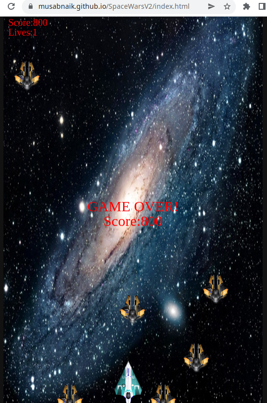

# SpaceWarsV2

## Introduction
This is a remake of a 2d game I made a while back using Java applet(can found at this [link](https://github.com/MusabNaik/SpaceWars-Java-applet-2d-game)). As Java is no longer supported on web browsers, I rewrote the code in JavaScript. This is also hosted on GitHub Pages and can be accessed at this [link](https://musabnaik.github.io/SpaceWarsV2/index.html)

## Game Play

Live demo can be accessed at this [link](https://musabnaik.github.io/SpaceWarsV2/index.html)

|| Control player|
|-----------| ----------------------------------|
|| Shoot|

## Screenshots

